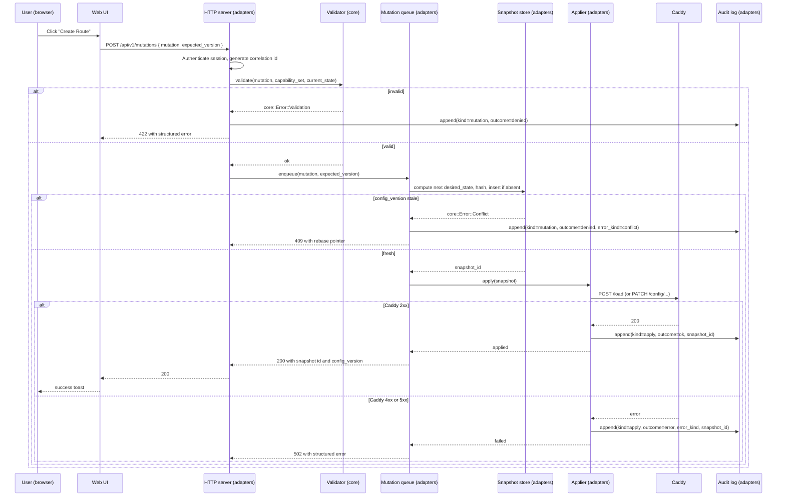
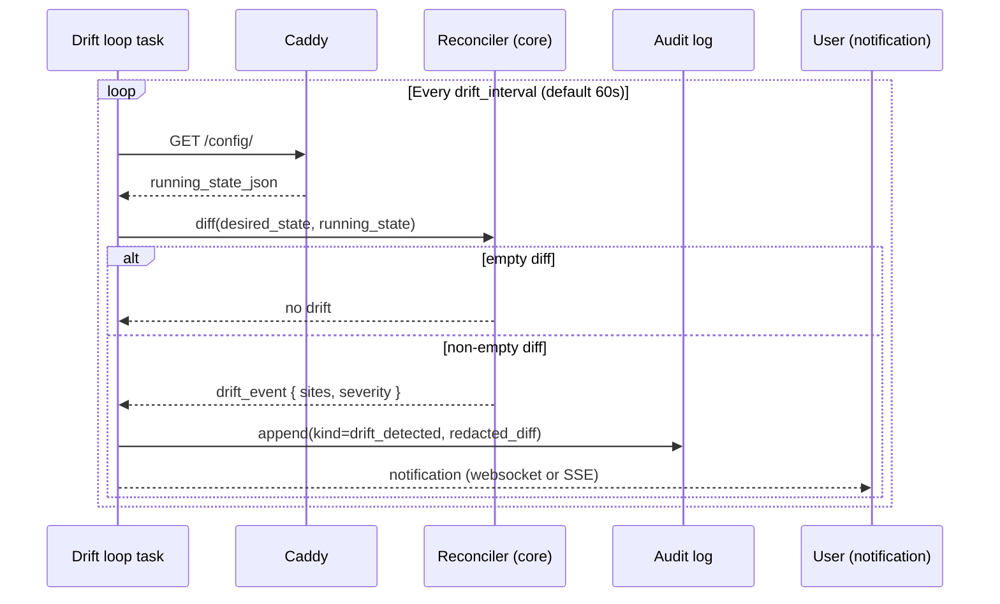

# Trilithon Architecture

## 1. Document control

| Field | Value |
|-------|-------|
| Document title | Trilithon Architecture |
| Version | 1.0.0 |
| Date | 2026-04-30 |
| Status | Accepted |
| Owner | Project owner |
| Supersedes | None |
| Source of authority | `docs/prompts/PROMPT-spec-generation.md` |

This document is the canonical architecture reference for Trilithon V1. It is downstream of the project meta-prompt and inherits every constraint stated in sections 2, 3, 7, 8.3, and 9 of that prompt. Where this document and the prompt disagree, the prompt wins; raise the contradiction in an Architecture Decision Record rather than silently editing this file.

## 2. Glossary

The canonical glossary lives in section 3 of the meta-prompt. The terms below are introduced or further specified by this document.

| Term | Definition |
|------|------------|
| **Reconciler** | The component inside `core` that compares desired state and running state and emits a deterministic mutation plan. Pure function. |
| **Applier** | The component inside `adapters` that takes a mutation plan and writes it through Caddy's Admin API. Performs input/output. |
| **Drift loop** | The periodic task in the daemon that calls the reconciler against running state pulled from Caddy and emits a drift event when a non-empty diff is observed. |
| **Snapshot writer queue** | A bounded multi-producer single-consumer channel that serialises snapshot writes to SQLite. |
| **Tool gateway** | The authenticated, capability-scoped HTTP surface dedicated to language-model agents. Distinct from the human web UI's API; both ride the same mutation primitives. |
| **Secrets vault** | The pair of (encrypted blob column, master-key handle) that stores secret material at rest under XChaCha20-Poly1305. |
| **Redactor** | The pure function that walks a JSON value, replaces every field tagged `secret` in the schema registry with a stable hash placeholder, and returns the redacted value plus a list of redaction sites. |
| **Ownership sentinel** | A configuration object inserted by Trilithon into Caddy under the identifier `trilithon-owner`, asserting which Trilithon installation owns this Caddy. |
| **Capability set** | The frozen result of the capability probe. A set of module identifiers and version markers used to gate validation. |
| **Correlation identifier** | A ULID generated at the entry boundary (HTTP request, scheduler tick, Docker event) and propagated through every layer via `tracing::Span`. |
| **Daemon** | The single Rust binary produced by the `cli` crate. Owns the Tokio runtime and every long-lived task. |

## 3. System context

Trilithon is a single daemon with a web frontend, sitting next to an unmodified Caddy. The system context is small by design.

```mermaid
flowchart LR
  user[Human user<br/>browser on localhost]
  llm[Language-model client<br/>external process]
  daemon[Trilithon daemon<br/>Rust binary]
  ui[Web UI<br/>React 19 + Vite static bundle<br/>served by daemon]
  caddy[Caddy 2.8 or later<br/>unmodified]
  sqlite[(SQLite database<br/>WAL mode)]
  keychain[(Master key store<br/>OS keychain or 0600 file)]
  docker[(Docker engine<br/>Unix socket)]
  fleet[[Remote Caddy fleet<br/>OUT OF SCOPE FOR V1<br/>T3.1 hook reserved]]

  user -- HTTPS or HTTP loopback --> daemon
  daemon -- static files --> ui
  llm -- HTTP plus bearer token --> daemon
  daemon -- HTTP over Unix socket or loopback --> caddy
  daemon -- file system --> sqlite
  daemon -- IPC --> keychain
  daemon -- HTTP over Unix socket --> docker
  daemon -. T3.1 outbound mTLS .-> fleet

  classDef external fill:#eee,stroke:#666,color:#000;
  classDef out fill:#fafafa,stroke:#bbb,color:#888,stroke-dasharray: 4 4;
  class caddy,docker,llm,user,keychain external;
  class fleet out;
```

Boundaries:

- **Network boundary, browser to daemon.** Loopback by default on `127.0.0.1:7878`. Binding to a non-loopback address is opt-in and prints a startup warning. Authentication is mandatory regardless of binding.
- **Network boundary, language-model client to daemon.** Same listener as the human user, distinguished by the path prefix `/api/tool/` and a bearer token. Token presents per-call permission scope.
- **Process boundary, daemon to Caddy.** Unix domain socket by default. Loopback TCP with mutual TLS is the alternate posture. Caddy's admin endpoint is never exposed to a non-loopback interface (hazard H1).
- **Process boundary, daemon to Docker.** Unix domain socket only. The daemon container, when used, is the sole holder of the socket; Caddy's container never receives it (hazard H11).
- **Process boundary, daemon to keychain.** Local IPC on macOS (`Security.framework`) and Linux (`Secret Service`). The fallback file is `0600` and lives outside the SQLite directory.
- **Trust boundary, daemon to remote Caddy fleet.** OUT OF SCOPE FOR V1. The schema reserves `caddy_instance_id` so that V1 does not preclude T3.1.

## 4. Component view

> **Trait surfaces are documented separately.** Every Rust trait introduced in this section (and elsewhere in the workspace) has its full async signature, ownership, error type, and lifetime documented in [`trait-signatures.md`](trait-signatures.md). This section lists the traits by name and responsibility; the canonical signatures live there.

### 4.1 Rust crate `core`

**Path.** `core/crates/core/`.

**Responsibility.** Pure logic. The reconciler, the validator, the diff engine, the redactor, the snapshot hasher, the mutation type set, and the desired-state model. No input/output, no async runtime, no foreign function interface, no panic in production code paths. Everything in `core` MUST be deterministic.

**Owned types and data.**

- `DesiredState` — the typed in-memory model. Carries `config_version: u64` and `caddy_instance_id` (hard-coded `local` in V1).
- `Mutation` — the closed enumeration of typed mutations (T1.6). Each variant is `serde`-tagged and carries a `pre_condition` description for the validator.
- `Snapshot` — content-addressed by SHA-256 of canonical JSON. Carries actor, intent, correlation identifier, parent identifier, Caddy version marker, Trilithon version, UTC Unix timestamp, and the desired-state JSON.
- `Diff` — typed diff between two desired states or between desired state and a Caddy JSON document.
- `CapabilitySet` — the frozen capability probe result, consumed by validation.
- `RedactedValue` — output of the redactor; carries the list of redaction sites for audit reporting.
- `PolicyPreset` — the seven V1 presets (T2.2), each versioned.

**External dependencies.** `serde`, `serde_json`, `thiserror`, `sha2`, `time` (UTC handling only), `ulid`. No Tokio. No `sqlx`. No `reqwest`. No `hyper`. No filesystem. The manifest enforces this.

**Errors produced.** `core::Error` is a `thiserror` enumeration. Variants:

- `Validation { rule, path, hint }` — the mutation or snapshot fails a static rule.
- `CapabilityMissing { module, required_by }` — the configuration references a Caddy module not in the capability set (hazard H5).
- `Conflict { observed_version, expected_version }` — optimistic concurrency rejected the mutation (T2.10, hazard H8).
- `Schema { field, kind }` — schema violation against the typed mutation set.
- `Redaction { site_count }` — emitted by the redactor when secret fields are detected in a write path that must not carry them.

`core::Error` MUST NOT carry plaintext secrets. The `Display` implementation rejects values tagged `secret` at compile time via the schema registry. This is the load-bearing rule that keeps secrets out of audit log diffs (hazard H10).

### 4.2 Rust crate `adapters`

**Path.** `core/crates/adapters/`.

**Responsibility.** Wrap every external surface that `core` is forbidden from touching. The Caddy Admin API client, the Docker engine client, the SQLite store, the keychain reader, the encryption envelope, the HTTP server, and the static-asset serving for the web UI. `adapters` MUST NOT contain business policy. Decisions belong to `core`. `adapters` carries the bytes.

**Owned types and data.**

- `CaddyClient` — typed wrapper over Caddy Admin API with a transport (`hyper` over Unix socket or loopback TCP).
- `DockerWatcher` — tokio task that subscribes to `events` and emits typed `ContainerEvent` values.
- `SnapshotStore` — typed wrapper over the `snapshots` table.
- `AuditLogStore` — typed wrapper over the `audit_log` table. Append-only.
- `ProposalStore` — typed wrapper over the `proposals` table.
- `SecretsVault` — XChaCha20-Poly1305 envelope with a master key fetched via `KeychainHandle`.
- `KeychainHandle` — abstracts macOS Keychain, Linux Secret Service, and the `0600` file fallback.
- `HttpServer` — Axum router serving the human UI API, the tool gateway, and the static bundle.
- `MetricsExporter` — optional Prometheus text-format endpoint on a separate port.

**External dependencies.** `tokio`, `sqlx` (SQLite, offline-prepared queries), `hyper`, `hyperlocal` (Unix socket transport), `axum`, `tower`, `tracing`, `bollard` (Docker), `chacha20poly1305`, `argon2`, `keyring`, `serde`, `serde_json`, `ulid`. May depend on `core`.

**Errors produced.** `adapters::Error` is a `thiserror` enumeration that wraps the underlying transport error and a concrete kind.

- `CaddyUnreachable { transport, attempt }` — connection refused or socket missing.
- `CaddyHttp { status, body_excerpt }` — Caddy returned a non-2xx response. The `body_excerpt` is bounded and redacted.
- `Sqlite { kind }` where `kind` is one of `Locked`, `Corrupt`, `Migration`, `Constraint`.
- `Docker { kind }` where `kind` is `SocketMissing`, `Permission`, `EventStreamLost`.
- `Keychain { kind }` where `kind` is `Locked`, `NotFound`, `Backend`.
- `Crypto { kind }` where `kind` is `KeyMissing`, `Decrypt`, `Encrypt`.
- `Listener { kind }` where `kind` is `PortInUse`, `Bind`, `TlsConfig`.

Every variant has a `Display` implementation that omits secret bytes and bounded-truncates response bodies.

### 4.3 Rust crate `cli`

**Path.** `core/crates/cli/`.

**Responsibility.** The binary. Parses arguments with `clap`, sets up `tracing-subscriber`, builds the multi-thread Tokio runtime, wires `core` to `adapters`, registers signal handlers (`SIGTERM`, `SIGINT`), and supervises long-lived tasks. Owns the `anyhow::Result` boundary; below `cli`, error types are concrete.

**Owned types and data.**

- `Cli` — clap derive structure with subcommands `serve`, `import`, `export`, `migrate`, `keygen`, `whoami`.
- `RuntimeConfig` — the resolved configuration after parsing arguments and reading the configuration file.
- `Supervisor` — the task graph that launches and joins long-lived tasks, propagating shutdown.

**External dependencies.** `core`, `adapters`, `clap`, `tokio` (multi-thread runtime), `tracing`, `tracing-subscriber`, `anyhow`. May not introduce business policy beyond wiring.

**Errors produced.** `anyhow::Error` only. Errors from `core` and `adapters` are reported through `tracing::error!` and translated to a process exit code.

### 4.4 Rust crate `ffi`

**Path.** `core/crates/ffi/`.

**Responsibility.** Reserved foreign-function-interface surface for the V1.1 Tauri desktop wrapper. In V1, `ffi` exposes a minimal UniFFI binding that surfaces the typed mutation set and the snapshot reader, intended for in-process consumption only. `ffi` does not host the daemon and does not own a Tokio runtime. The web UI in V1 talks to the daemon via HTTP, not via `ffi`.

**Owned types and data.** UniFFI-generated wrappers around `core::Mutation`, `core::DesiredState`, and a thin handle to a daemon-supplied gateway. The Caddy interface description language file at `core/crates/ffi/src/core.udl` is the source of truth.

**External dependencies.** `uniffi`, `core`. The `build.rs` generates scaffolding at build time. `ffi` MUST NOT depend on `adapters`.

**Errors produced.** `ffi::Error` is a `thiserror` enumeration that wraps `core::Error` variants and adds `Binding { reason }` for foreign-function-interface marshalling failures. No I/O errors are produced by `ffi` itself; consumers attach their own.

### 4.5 Frontend module group: UI shell

**Path.** `web/src/shell/`.

**Responsibility.** Application bootstrap, top-level layout, navigation, theme, error boundary, authentication state hydration, and global toast surface. Owns the React Router tree and the React Query client.

**Owned data.** Authentication state (session token, current user identifier, role), navigation state, theme.

**External dependencies.** React 19, React Router, TanStack Query, Tailwind 3.

**Errors surfaced.** A top-level error boundary renders a recovery panel and emits the correlation identifier of the failing request when present. Network errors map to a typed banner with retry.

### 4.6 Frontend module group: Route management

**Path.** `web/src/routes/`.

**Responsibility.** Lists routes, renders route detail, hosts the create-route wizard, and binds the typed mutation API for create, read, update, and delete (T1.8). Surfaces TLS certificate visibility (T1.9) and basic upstream health (T1.10).

**Owned data.** Route list view model, certificate status view model, upstream reachability view model. All cached through React Query against `/api/v1/routes` and `/api/v1/certificates`.

**External dependencies.** UI shell, dual-pane editor (for advanced edits), proposals queue (for accepting Docker proposals into a route).

**Errors surfaced.** Validation errors are rendered against the offending field. Capability-missing errors render the documentation link prescribed by T1.11.

### 4.7 Frontend module group: Dual-pane editor

**Path.** `web/src/editor/`.

**Responsibility.** The power-user escape hatch (T1.12). Renders Caddyfile-style legible form on the left and raw JSON on the right. Edits in either pane validate live and update the other. Apply is disabled while validation is failing. A valid edit produces a preview diff against current desired state before commit.

**Owned data.** Editor document, validation result, diff against desired state.

**External dependencies.** A typed validator surface exposed by the daemon at `/api/v1/validate`. The validator is `core::validate` invoked through `adapters`.

**Errors surfaced.** Structured validation errors with line and key pointers. The editor renders them inline against the offending position.

### 4.8 Frontend module group: Proposals queue

**Path.** `web/src/proposals/`.

**Responsibility.** Lists pending proposals from any source (Docker discovery T2.1, language-model `propose` mode T2.4). Renders the wildcard-certificate security callout (T2.11) where applicable. Supports approve, reject, and expire-on-window.

**Owned data.** Proposal list view model, proposal detail view model, approval form state.

**External dependencies.** `/api/v1/proposals`. Surfaces the audit log entry for every approval and rejection.

**Errors surfaced.** Conflict errors when a proposal targets stale desired state (T2.10). Capability errors on validation failure.

### 4.9 Frontend module group: Audit log viewer

**Path.** `web/src/audit/`.

**Responsibility.** Browses the audit log (T1.7). Filters by actor, correlation identifier, kind, and time range. Renders redacted diffs.

**Owned data.** Audit log query view model, paged results.

**External dependencies.** `/api/v1/audit`. Times displayed in the viewer's local time zone (hazard H6); stored as UTC Unix timestamps.

**Errors surfaced.** Read errors map to a banner. Audit entries that cannot be rendered are flagged but not omitted; the redactor's site count is shown.

### 4.10 Frontend module group: Access log viewer

**Path.** `web/src/access-logs/`.

**Responsibility.** T2.5 and T2.6. Streams Caddy access logs and supports the "explain this entry" call.

**Owned data.** Live tail buffer, filter form state, explanation view model.

**External dependencies.** Server-sent events stream at `/api/v1/access-logs/stream`. Filter endpoint at `/api/v1/access-logs/query`. Explanation endpoint at `/api/v1/access-logs/explain`.

**Errors surfaced.** Stream disconnection renders a reconnect banner. Explanation failures render the partial trace.

### 4.11 Frontend module group: Dashboard

**Path.** `web/src/dashboard/`.

**Responsibility.** Aggregate overview: total routes, drift status, proposals pending, certificates expiring, upstream health summary, last apply time.

**Owned data.** Dashboard view model, refreshed at a 10-second interval through React Query.

**External dependencies.** `/api/v1/dashboard`.

**Errors surfaced.** Partial failures render per-card; one failing card does not blank the dashboard.

### 4.12 Frontend module group: Settings

**Path.** `web/src/settings/`.

**Responsibility.** User account management, session revocation, capability set inspection, drift-loop interval configuration, backup and restore (T2.12), import (T1.5) and export (T2.9).

**Owned data.** Settings view model.

**External dependencies.** `/api/v1/settings`, `/api/v1/import`, `/api/v1/export`, `/api/v1/backup`.

**Errors surfaced.** Backup-restore validation errors are rendered with a structured failure list.

### 4.13 Frontend module group: Language-model panel

**Path.** `web/src/llm/`.

**Responsibility.** Surfaces language-model interactions (T2.3 explain mode, T2.4 propose mode). Lists tool-gateway tokens, the per-token permission set, and the audit trail.

**Owned data.** Token list view model, session list view model, prompt-response transcript.

**External dependencies.** `/api/v1/llm/tokens`, `/api/v1/llm/sessions`, `/api/v1/llm/audit`.

**Errors surfaced.** Token revocation conflicts. Permission denials render the offending tool identifier and the missing capability.

## 5. Layer rules

The three-layer split is enforced by manifest dependencies. The compiler is the policeman.

| From | MAY depend on | MUST NOT depend on | Rationale |
|------|---------------|---------------------|-----------|
| `core` | `serde`, `serde_json`, `thiserror`, `sha2`, `time` (UTC only), `ulid` | `tokio`, `sqlx`, `reqwest`, `hyper`, `axum`, `bollard`, `keyring`, `chacha20poly1305`, `tracing-subscriber`, `anyhow`, the standard library's filesystem and process modules in non-test code | Pure logic stays portable, deterministic, and testable. The reconciler must run in a Tauri host without changes (V1.1). |
| `adapters` | `core`, `tokio`, `sqlx`, `hyper`, `hyperlocal`, `axum`, `tower`, `bollard`, `keyring`, `chacha20poly1305`, `argon2`, `tracing`, `serde`, `serde_json`, `ulid` | `clap`, `anyhow`, business policy of any kind | Adapters carry bytes, never decisions. Decisions belong to `core`. |
| `cli` | `core`, `adapters`, `clap`, `tokio`, `tracing-subscriber`, `anyhow` | Direct use of `sqlx`, direct use of `hyper`, direct use of `bollard`, direct use of `keyring` | The binary wires components. It does not reach past `adapters` to the underlying clients. |
| `ffi` | `core`, `uniffi` | `adapters`, `tokio`, every I/O crate | `ffi` is a typed surface for embedding `core` in another runtime. It does not embed the daemon. |

Cross-layer dependency requests stop at the manifest. If a feature appears to require `core` to import `tokio` or `sqlx`, the design is wrong; raise the question in an Architecture Decision Record.

## 6. Data model

All tables live in a single SQLite database file (`trilithon.db`), Write-Ahead-Log mode, with `synchronous = NORMAL`, `foreign_keys = ON`, and `busy_timeout = 5000`. Every wall-clock column is a UTC Unix timestamp stored as `INTEGER` (seconds since epoch); a parallel `INTEGER` column suffixed `_ms` carries millisecond resolution where required (hazard H6). Migrations are recorded in a dedicated `schema_migrations` table.

### 6.1 `schema_migrations`

```sql
CREATE TABLE schema_migrations (
    version       INTEGER PRIMARY KEY,
    applied_at    INTEGER NOT NULL,
    description   TEXT NOT NULL,
    checksum      TEXT NOT NULL
);
```

Write boundary: only the migration runner in `adapters::migrate` writes here. Retention: forever.

### 6.2 `users`

```sql
CREATE TABLE users (
    id               TEXT PRIMARY KEY,
    username         TEXT NOT NULL UNIQUE,
    password_hash    TEXT NOT NULL,
    role             TEXT NOT NULL CHECK (role IN ('owner', 'operator', 'reader')),
    created_at       INTEGER NOT NULL,
    must_change_pw   INTEGER NOT NULL DEFAULT 0,
    disabled_at      INTEGER
);
CREATE INDEX users_disabled_at ON users(disabled_at);
```

Primary key: `id` (ULID). Foreign keys: none. Indexes: `username` unique, `disabled_at`. Retention: indefinite. Write boundary: `adapters::auth`. Bootstrap account is seeded on first run with `must_change_pw = 1` (hazard H13).

### 6.3 `sessions`

```sql
CREATE TABLE sessions (
    id              TEXT PRIMARY KEY,
    user_id         TEXT NOT NULL REFERENCES users(id) ON DELETE CASCADE,
    created_at      INTEGER NOT NULL,
    last_seen_at    INTEGER NOT NULL,
    expires_at      INTEGER NOT NULL,
    revoked_at      INTEGER,
    user_agent      TEXT,
    ip_address      TEXT
);
CREATE INDEX sessions_user_id ON sessions(user_id);
CREATE INDEX sessions_expires_at ON sessions(expires_at);
```

Primary key: `id` (opaque random 256-bit value). Foreign key: `user_id` to `users`. Retention: rows are deleted by a janitor task one hour after `expires_at` or `revoked_at`.

### 6.4 `tokens`

The tool-gateway token table.

```sql
CREATE TABLE tokens (
    id              TEXT PRIMARY KEY,
    name            TEXT NOT NULL,
    token_hash      TEXT NOT NULL UNIQUE,
    permissions     TEXT NOT NULL,
    created_by      TEXT NOT NULL REFERENCES users(id),
    created_at      INTEGER NOT NULL,
    last_used_at    INTEGER,
    expires_at      INTEGER,
    revoked_at      INTEGER,
    rate_limit_qps  INTEGER NOT NULL DEFAULT 5
);
CREATE INDEX tokens_revoked_at ON tokens(revoked_at);
```

`permissions` is a canonical-JSON capability set. The plaintext token is shown to the creator exactly once. Write boundary: `adapters::tokens`. Retention: indefinite, but tokens past `expires_at` are not accepted by the gateway.

### 6.5 `snapshots`

```sql
CREATE TABLE snapshots (
    id                  TEXT PRIMARY KEY,
    parent_id           TEXT REFERENCES snapshots(id),
    caddy_instance_id   TEXT NOT NULL DEFAULT 'local',
    actor_kind          TEXT NOT NULL CHECK (actor_kind IN ('user', 'token', 'system')),
    actor_id            TEXT NOT NULL,
    intent              TEXT NOT NULL,
    correlation_id      TEXT NOT NULL,
    caddy_version       TEXT NOT NULL,
    trilithon_version   TEXT NOT NULL,
    created_at                   INTEGER NOT NULL,
    created_at_ms                INTEGER NOT NULL,
    created_at_monotonic_nanos   INTEGER NOT NULL,                  -- process-local monotonic clock; orders within a single daemon run
    canonical_json_version       INTEGER NOT NULL DEFAULT 1,        -- canonical-JSON serialiser format version (initial value 1)
    config_version               INTEGER NOT NULL,
    desired_state_json           TEXT NOT NULL
);
CREATE INDEX snapshots_parent_id ON snapshots(parent_id);
CREATE INDEX snapshots_correlation_id ON snapshots(correlation_id);
CREATE INDEX snapshots_caddy_instance_id ON snapshots(caddy_instance_id);
CREATE UNIQUE INDEX snapshots_config_version ON snapshots(caddy_instance_id, config_version);
```

Primary key: `id` (`sha256` of the canonical JSON serialisation, lowercase hex, T1.2). Snapshots are immutable; no `UPDATE` statement targets this table anywhere in the codebase. Write boundary: `adapters::snapshot_store::insert_if_absent`. Retention: indefinite. Pruning is opt-in and OUT OF SCOPE FOR V1.

`created_at_monotonic_nanos` is read from `std::time::Instant::elapsed_since(daemon_start)` and serves as a tiebreaker when two snapshots within a single daemon run share the same `created_at_ms` value. It is process-local and monotonic; it MUST NOT be used to order events across daemon restarts (use `created_at_ms` for that). `canonical_json_version` is bumped only by an ADR-ratified change to the canonical-JSON serialiser format; V1 ships with version 1.

### 6.6 `audit_log`

```sql
CREATE TABLE audit_log (
    id                 TEXT PRIMARY KEY,
    correlation_id     TEXT NOT NULL,
    occurred_at        INTEGER NOT NULL,
    occurred_at_ms     INTEGER NOT NULL,
    actor_kind         TEXT NOT NULL,
    actor_id           TEXT NOT NULL,
    kind               TEXT NOT NULL,
    target_kind        TEXT,
    target_id          TEXT,
    snapshot_id        TEXT REFERENCES snapshots(id),
    redacted_diff_json TEXT,
    redaction_sites    INTEGER NOT NULL DEFAULT 0,
    outcome            TEXT NOT NULL CHECK (outcome IN ('ok', 'error', 'denied')),
    error_kind         TEXT,
    notes              TEXT
);
CREATE INDEX audit_log_correlation_id ON audit_log(correlation_id);
CREATE INDEX audit_log_occurred_at ON audit_log(occurred_at);
CREATE INDEX audit_log_actor_id ON audit_log(actor_id);
CREATE INDEX audit_log_kind ON audit_log(kind);
```

Primary key: `id` (ULID). Audit rows are immutable; no `UPDATE` statement targets this table anywhere in the codebase. The `redacted_diff_json` column carries a diff that has passed through the redactor (T1.7, T1.15, hazard H10). The `redaction_sites` column reports the count for transparency. Retention: indefinite. Pruning is opt-in and OUT OF SCOPE FOR V1. Write boundary: `adapters::audit_log_store::append`.

#### Audit `kind` vocabulary (V1)

The `kind` column carries a structured event name. The convention is
`<domain>.<event>`: lowercase letters, digits, dots and hyphens only,
matching the regex `^[a-z][a-z0-9-]*(\.[a-z][a-z0-9-]*)+$`. The regex
MUST be enforced at the storage adapter boundary. The implementer
chooses one of two equivalent enforcement points:

- a SQLite `CHECK` constraint on the `kind` column expressed as a
  `regexp` predicate via the `sqlite3_create_function` regexp hook
  registered at connection open; or
- explicit insert-time validation in `adapters::audit_log_store::append`,
  rejecting the row with a typed error before the `INSERT` is issued.

Both options satisfy the boundary requirement; the second is simpler
to test in isolation and is the recommended default. Whichever is
chosen, the regex string lives exactly once in the codebase.

The complete V1 vocabulary, sorted alphabetically:

| `kind` | Description |
| --- | --- |
| `auth.bootstrap-credentials-created` | The first-run bootstrap credential pair was generated and written to the permission-restricted file. Distinct from `auth.bootstrap-credentials-rotated`. |
| `auth.bootstrap-credentials-rotated` | The first-run bootstrap credential pair was rotated out. |
| `auth.login-failed` | An authentication attempt was rejected (bad password, expired session, locked account). |
| `auth.login-succeeded` | An authentication attempt produced a valid session. |
| `auth.logout` | A session was terminated by the user. |
| `auth.session-revoked` | A session was terminated administratively or by policy. |
| `caddy.capability-probe-completed` | The capability probe finished and recorded a fresh capability set for an instance. |
| `caddy.ownership-sentinel-conflict` | The ownership sentinel did not match Trilithon's expected value (ADR-0015). |
| `caddy.ownership-sentinel-takeover` | The operator forcibly seized ownership of a Caddy instance previously claimed by another Trilithon, via the `--takeover` flag. Distinct from the conflict event because it records an action, not an observation. |
| `caddy.reconnected` | A previously unreachable Caddy admin endpoint became reachable again. |
| `caddy.unreachable` | The Caddy admin endpoint failed health checks and is currently unreachable. |
| `config.applied` | A new desired-state snapshot was successfully loaded into Caddy. |
| `config.apply-failed` | A load attempt against the Caddy admin API failed and was rolled back. |
| `config.drift-detected` | The reconciler observed Caddy's running config diverging from Trilithon's desired state. |
| `config.drift-resolved` | A previously detected drift was resolved (re-applied or accepted). |
| `config.exported` | A configuration bundle was produced via the export path (T2.9). |
| `config.imported` | Alias retained for any historical rows produced before the V1 vocabulary settled; new rows MUST use `import.caddyfile`. |
| `config.rebased` | A pending mutation was rebased onto a newer `config_version` (Phase 17). |
| `config.rolled-back` | A previous snapshot was reapplied as the current desired state. |
| `docker.socket-trust-grant` | Recorded once on first daemon startup whose configuration mounts the Docker socket; the audit row is the consent record for the trust grant. |
| `export.bundle` | A native bundle export was completed. |
| `export.caddy-json` | A Caddy JSON export was completed. |
| `export.caddyfile` | A best-effort Caddyfile export was completed; lossy warnings list is recorded in the row. |
| `import.caddyfile` | A Caddyfile was imported. Replaces the legacy `config.imported` kind for new rows. |
| `mutation.applied` | A mutation reached terminal `applied` state. |
| `mutation.conflicted` | A mutation was rejected because its `expected_version` did not match `config_version`. |
| `mutation.proposed` | A proposal mutation was generated by an upstream source (Docker, language model, import). |
| `mutation.rebase.expired` | A rebase token expired before the actor saved. |
| `mutation.rebased.auto` | The rebase planner found mutations commutative and merged automatically. |
| `mutation.rebased.manual` | The actor resolved a three-way merge by hand. |
| `mutation.rejected` | A mutation was rejected by validation, policy, or operator decision. |
| `mutation.rejected.missing-expected-version` | A mutation request lacked the required `expected_version` envelope. |
| `mutation.submitted` | A mutation entered the queue. |
| `policy-preset.attached` | A policy preset version was attached to a route. |
| `policy-preset.detached` | A policy preset attachment was removed from a route. |
| `policy-preset.upgraded` | A route's policy preset attachment was upgraded to a newer version. |
| `policy.registry-mismatch` | At apply time, an attached preset version was no longer present in the registry. |
| `proposal.approved` | A pending proposal was approved and converted into a mutation. |
| `proposal.expired` | A pending proposal passed its expiry without a decision. |
| `proposal.rejected` | A pending proposal was rejected by the operator. |
| `secrets.master-key-fallback-engaged` | At daemon startup, the OS keychain backend was unavailable and the master-key file backend was selected as the fallback. |
| `secrets.master-key-rotated` | The master key in the OS keychain was rotated; ciphertexts were re-encrypted. |
| `secrets.revealed` | A secret value was decrypted and returned to a caller. |
| `system.restore-applied` | A backup bundle was restored to the running daemon, replacing the desired state. |
| `system.restore-cross-machine` | A restore was applied on a machine other than the machine that produced the backup; the master-key handoff was performed out-of-band. |
| `tool-gateway.session-opened` | A language-model gateway session was created (ADR-0008). |
| `tool-gateway.session-closed` | A language-model gateway session was closed or expired. |
| `tool-gateway.tool-invoked` | A tool call was issued through the gateway (success, denial, rate-limit refusal, or schema rejection). |

**Vocabulary authority.** The §6.6 table above is authoritative. New audit kinds MUST be added here in the same commit that introduces a phase emitting them. Any kind appearing in code that is not in this table SHALL fail the storage adapter's insert-time validation. Provenance: see `docs/audit/AUDIT-2026-04-30.md` §4.4 and `docs/audit/AUDIT-2026-05-01-A3.md` §6.1.

**Convention divergence with tracing events.** The audit `kind` and tracing event vocabularies are separate (this section is the source of truth for audit; §12.1 is the source of truth for tracing). Where the same logical event appears in both, the punctuation differs by design: audit kinds compress the verb into a hyphenated final noun (`caddy.capability-probe-completed`), while tracing events split the verb out as a separate dot-segment (`caddy.capability-probe.completed`). Both forms satisfy their respective regexes. Implementers MUST NOT cross-pollinate: an audit row's `kind` column never carries a tracing event name, and a tracing span's event field never carries an audit kind.

#### Rust `AuditEvent` ↔ wire `kind` mapping

The Phase 6 audit log writer holds a Rust enum `core::audit::AuditEvent` whose variants use `PascalCase` names. The wire `kind` string written to the `audit_log.kind` column is the dotted form from the §6.6 table. The rule: each variant's `Display` impl returns the dotted kind string verbatim, and `adapters::audit_log_store::append` writes that string. The mapping is one-to-one; no variant maps to two kinds and no kind maps to two variants.

Examples (non-exhaustive):

| Rust variant (`core::audit::AuditEvent`) | Wire `kind` |
| --- | --- |
| `MutationProposed` | `mutation.proposed` |
| `MutationApplied` | `mutation.applied` |
| `MutationConflicted` | `mutation.conflicted` |
| `MutationRejectedMissingExpectedVersion` | `mutation.rejected.missing-expected-version` |
| `MutationRebasedAuto` | `mutation.rebased.auto` |
| `MutationRebasedManual` | `mutation.rebased.manual` |
| `MutationRebaseExpired` | `mutation.rebase.expired` |
| `ApplySucceeded` | `config.applied` |
| `ApplyFailed` | `config.apply-failed` |
| `DriftDetected` | `config.drift-detected` |
| `DriftResolved` | `config.drift-resolved` |
| `OwnershipSentinelConflict` | `caddy.ownership-sentinel-conflict` |
| `CaddyReconnected` | `caddy.reconnected` |
| `CaddyUnreachable` | `caddy.unreachable` |
| `CaddyCapabilityProbeCompleted` | `caddy.capability-probe-completed` |
| `SecretsRevealed` | `secrets.revealed` |
| `SecretsMasterKeyRotated` | `secrets.master-key-rotated` |
| `ToolGatewayInvoked` | `tool-gateway.tool-invoked` |
| `ToolGatewaySessionOpened` | `tool-gateway.session-opened` |
| `ToolGatewaySessionClosed` | `tool-gateway.session-closed` |
| `ImportCaddyfile` | `import.caddyfile` |
| `ExportBundle` | `export.bundle` |
| `ExportCaddyJson` | `export.caddy-json` |
| `ExportCaddyfile` | `export.caddyfile` |
| `PolicyRegistryMismatch` | `policy.registry-mismatch` |
| `DockerSocketTrustGrant` | `docker.socket-trust-grant` |

### 6.7 `mutations`

The mutation queue. Entries are short-lived; once applied or rejected, they leave the queue and persist only as audit records.

```sql
CREATE TABLE mutations (
    id                  TEXT PRIMARY KEY,
    correlation_id      TEXT NOT NULL,
    submitted_by_kind   TEXT NOT NULL,
    submitted_by_id     TEXT NOT NULL,
    submitted_at        INTEGER NOT NULL,
    expected_version    INTEGER NOT NULL,
    payload_json        TEXT NOT NULL,
    state               TEXT NOT NULL CHECK (state IN ('queued', 'validating', 'applying', 'applied', 'rejected', 'failed')),
    state_changed_at    INTEGER NOT NULL,
    result_snapshot_id  TEXT REFERENCES snapshots(id),
    failure_kind        TEXT,
    failure_message     TEXT
);
CREATE INDEX mutations_state ON mutations(state);
CREATE INDEX mutations_correlation_id ON mutations(correlation_id);
```

Primary key: `id` (ULID). Foreign key: `result_snapshot_id` to `snapshots`. Retention: rows are deleted once `state` is terminal (`applied`, `rejected`, `failed`) and the corresponding audit row has been written. Write boundary: `adapters::mutation_queue`.

### 6.8 `proposals`

```sql
CREATE TABLE proposals (
    id                  TEXT PRIMARY KEY,
    correlation_id      TEXT NOT NULL,
    source              TEXT NOT NULL CHECK (source IN ('docker', 'llm', 'import')),
    source_ref          TEXT,
    payload_json        TEXT NOT NULL,
    rationale           TEXT,
    submitted_at        INTEGER NOT NULL,
    expires_at          INTEGER NOT NULL,
    state               TEXT NOT NULL CHECK (state IN ('pending', 'approved', 'rejected', 'expired', 'superseded')),
    decided_by_kind     TEXT,
    decided_by_id       TEXT,
    decided_at          INTEGER,
    wildcard_callout    INTEGER NOT NULL DEFAULT 0,
    wildcard_ack_by     TEXT,
    wildcard_ack_at     INTEGER,
    resulting_mutation  TEXT REFERENCES mutations(id)
);
CREATE INDEX proposals_state ON proposals(state);
CREATE INDEX proposals_expires_at ON proposals(expires_at);
CREATE INDEX proposals_source ON proposals(source);
```

Primary key: `id` (ULID). Foreign key: `resulting_mutation` to `mutations`. Retention: rows in terminal states are retained for 30 days, then archived to the audit log and removed. Write boundary: `adapters::proposal_store`.

### 6.9 `secrets_metadata`

The encrypted secrets table. Plaintext is never stored; the master key lives in the OS keychain.

```sql
CREATE TABLE secrets_metadata (
    id                TEXT PRIMARY KEY,
    owner_kind        TEXT NOT NULL,
    owner_id          TEXT NOT NULL,
    field_path        TEXT NOT NULL,
    nonce             BLOB NOT NULL,
    ciphertext        BLOB NOT NULL,
    created_at        INTEGER NOT NULL,
    rotated_at        INTEGER,
    last_revealed_at  INTEGER,
    last_revealed_by  TEXT
);
CREATE UNIQUE INDEX secrets_metadata_owner_field ON secrets_metadata(owner_kind, owner_id, field_path);
```

Primary key: `id` (ULID). Encryption is XChaCha20-Poly1305 with a 24-byte nonce and the master key. A leaked SQLite file does not leak secrets (T1.15). Retention: deleted when the owning configuration object is deleted. Write boundary: `adapters::secrets_vault`.

### 6.10 `caddy_instances`

Reserved for T3.1 multi-instance fleet management. V1 inserts exactly one row with `id = 'local'`.

```sql
CREATE TABLE caddy_instances (
    id              TEXT PRIMARY KEY,
    display_name    TEXT NOT NULL,
    transport       TEXT NOT NULL CHECK (transport IN ('unix', 'loopback_mtls')),
    address         TEXT NOT NULL,
    created_at      INTEGER NOT NULL,
    last_seen_at    INTEGER,
    capability_json TEXT,
    ownership_token TEXT NOT NULL
);
```

Primary key: `id`. Foreign keys: none. Retention: indefinite. Write boundary: V1 hard-codes `local`; the column exists to keep the schema forward-compatible.

### 6.11 `policy_presets`

```sql
CREATE TABLE policy_presets (
    id           TEXT PRIMARY KEY,
    name         TEXT NOT NULL,
    version      INTEGER NOT NULL,
    body_json    TEXT NOT NULL,
    created_at   INTEGER NOT NULL
);
CREATE UNIQUE INDEX policy_presets_name_version ON policy_presets(name, version);
```

Primary key: `id` (ULID). Retention: indefinite; old versions are kept so attached routes continue to resolve their preset. Write boundary: `adapters::policy_store`. The seven V1 presets (T2.2) are seeded as version 1.

### 6.12 `route_policy_attachments`

```sql
CREATE TABLE route_policy_attachments (
    route_id          TEXT    NOT NULL,
    preset_id         TEXT    NOT NULL,
    preset_version    INTEGER NOT NULL,
    attached_at       INTEGER NOT NULL,   -- UTC unix seconds
    attached_by       TEXT    NOT NULL,   -- actor id
    correlation_id    TEXT    NOT NULL,   -- ULID
    PRIMARY KEY (route_id, preset_id),
    FOREIGN KEY (route_id)
        REFERENCES routes(id) ON DELETE CASCADE,
    FOREIGN KEY (preset_id, preset_version)
        REFERENCES policy_preset_versions(preset_id, version)
);
CREATE INDEX idx_rpa_preset_version
    ON route_policy_attachments(preset_id, preset_version);
```

The attachment row carries `preset_version` so the binding is to a specific, immutable preset version rather than to a mutable preset name. Versioned attachments prevent silent mutation when a preset definition changes upstream: edits produce a new `policy_preset_versions` row, existing attachments continue to resolve to the version they were attached against, and the user is prompted per-route to upgrade. This honours T2.2's acceptance criterion that "a preset edit MUST NOT silently alter the effective configuration of any already-attached route". Composite primary key on `(route_id, preset_id)` enforces that a route may attach a given preset at most once at a time. Retention: rows are deleted when the route is deleted via `ON DELETE CASCADE`. Write boundary: `adapters::policy_store`. See ADR-0016 for the rationale and ADR-0009 for the underlying immutable-snapshot principle this addendum extends.

### 6.13 `capability_probe_results`

```sql
CREATE TABLE capability_probe_results (
    id                  TEXT PRIMARY KEY,
    caddy_instance_id   TEXT NOT NULL REFERENCES caddy_instances(id),
    probed_at           INTEGER NOT NULL,
    caddy_version       TEXT NOT NULL,
    capabilities_json   TEXT NOT NULL,
    is_current          INTEGER NOT NULL DEFAULT 0
);
CREATE INDEX capability_probe_results_instance ON capability_probe_results(caddy_instance_id, probed_at);
CREATE UNIQUE INDEX capability_probe_results_current
    ON capability_probe_results(caddy_instance_id) WHERE is_current = 1;
```

Primary key: `id` (ULID). At most one row per `caddy_instance_id` has `is_current = 1`. Retention: the last 50 probes per instance are retained; older are pruned. Write boundary: `adapters::capability_probe`.

### 6.14 `tls_certificates`

```sql
CREATE TABLE tls_certificates (
    host             TEXT    NOT NULL,
    issuer           TEXT    NOT NULL,
    not_before       INTEGER NOT NULL,                -- UTC unix seconds
    not_after        INTEGER NOT NULL,                -- UTC unix seconds
    renewal_state    TEXT    NOT NULL,                -- 'pending' | 'renewed' | 'failed'
    renewal_detail   TEXT,                            -- free-text when renewal_state = 'failed'
    source           TEXT    NOT NULL,                -- 'acme' | 'internal' | 'imported'
    fetched_at       INTEGER NOT NULL,                -- UTC unix seconds
    PRIMARY KEY (host, issuer)
);
CREATE INDEX tls_certificates_not_after ON tls_certificates(not_after);
CREATE INDEX tls_certificates_renewal_state ON tls_certificates(renewal_state);
```

Primary key: `(host, issuer)`. Write boundary: `adapters::tls_inventory` via `Storage::upsert_tls_certificates`. Retention: the table mirrors current Caddy state; rows for hosts no longer present in Caddy are deleted by the upsert call's transactional sweep. Refresh cadence: every 5 minutes per Phase 14 freshness algorithm.

### 6.15 `upstream_health`

```sql
CREATE TABLE upstream_health (
    route_id      TEXT    NOT NULL,
    upstream_id   TEXT    NOT NULL,
    observed_at   INTEGER NOT NULL,                   -- UTC unix seconds
    reachable     INTEGER NOT NULL,                   -- 0 or 1
    latency_ms    INTEGER,                            -- NULL when unreachable
    source        TEXT    NOT NULL,                   -- 'tcp-probe' | 'http-probe' | 'caddy-api'
    detail        TEXT,                               -- free-text classification when reachable = 0
    PRIMARY KEY (route_id, upstream_id, observed_at),
    FOREIGN KEY (route_id) REFERENCES routes(id) ON DELETE CASCADE,
    FOREIGN KEY (upstream_id) REFERENCES upstreams(id) ON DELETE CASCADE
);
CREATE INDEX upstream_health_recent
    ON upstream_health(route_id, upstream_id, observed_at DESC);
```

Primary key: `(route_id, upstream_id, observed_at)`. Append-only. Write boundary: `adapters::upstream_health` via `Storage::upsert_upstream_health`. Retention: rolling window of 24 hours per `(route_id, upstream_id)` pair; older rows pruned by a daily background job; the most recent observation is always kept regardless of age.

## 7. Control flow

### 7.1 Mutation lifecycle (T1.6, T1.7, T1.8, T2.10)

The end-to-end path from a human button click to a confirmed apply.



Numbered steps:

1. The user clicks "Create Route" in the route management module.
2. The web UI sends `POST /api/v1/mutations` with the typed mutation payload and the `expected_version` it last observed.
3. The HTTP server authenticates the session, generates a fresh correlation identifier, and opens a `tracing::Span`.
4. The HTTP server invokes the validator in `core` with the mutation, the capability set, and the current desired state.
5. Validation either succeeds or returns a typed `core::Error`. On failure, the audit log records `outcome = denied` with the structured error and the response is `422`.
6. On success, the HTTP server enqueues the mutation in the mutation queue. The queue worker assigns the next `config_version` and computes the resulting desired state.
7. The snapshot writer queue serialises desired state to canonical JSON, hashes it with SHA-256, and inserts the snapshot row. If a row with the same hash exists, the insert is a no-op (T1.2 deduplication).
8. Optimistic concurrency check. If the observed `config_version` differs from `expected_version`, the queue rejects the mutation with `core::Error::Conflict` and the audit log records `outcome = denied, error_kind = conflict`.
9. The applier issues `POST /load` or `PATCH /config/...` to Caddy over the Unix socket or loopback transport.
10. Caddy responds. On `2xx`, the audit log records `outcome = ok`. On `4xx` or `5xx`, the audit log records `outcome = error` with `error_kind`. The response surfaces the structured error.
11. The HTTP server responds to the web UI with the new snapshot identifier and `config_version`. The web UI updates the cache and notifies the user.

**Audit emission rule for the happy path.** A successful mutation produces TWO audit rows, intentionally:

- `mutation.applied` — written by the HTTP layer at step 11 once the response is sent. Records the mutation's acceptance into Trilithon's desired state.
- `config.applied` — written by the applier at step 10 once Caddy returns 2xx. Records the successful reconciliation against Caddy's running configuration.

The two events describe different state transitions at different layers (acceptance of the mutation request vs successful reconciliation with Caddy). They share `correlation_id` so the audit viewer can collapse them into a single user-visible row when convenient. Implementations MUST NOT collapse them at write time.

**`Applier::apply` outcome semantics.** The applier returns `Result<ApplyOutcome, ApplyError>`. The two channels are not synonyms:

- `Ok(ApplyOutcome::Succeeded { .. })` — Caddy returned 2xx; reconciliation matches. Common path.
- `Ok(ApplyOutcome::Failed { error_kind, detail })` — Caddy returned 4xx (rejected validation, schema error, module unavailable). The failure is an expected outcome of an apply attempt; the desired-state pointer does not advance; the row records `outcome = error`. The HTTP response is 502 with the structured error.
- `Err(ApplyError::Unreachable { .. })` — transport failure (Caddy admin endpoint unreachable, mTLS handshake failed, socket gone). The failure is an unexpected runtime condition.
- `Err(ApplyError::OptimisticConflict { .. })` — `expected_version` did not match `config_version` at the snapshot writer. Surfaces as 409 to the user.
- `Err(ApplyError::PreflightFailed { .. })` — used by Phase 12's rollback preflight, not by the regular apply path.

Implementers MUST follow this split. A Caddy 4xx is an `Ok(Failed)`, not an `Err`. A network failure is an `Err`, not an `Ok(Failed)`.

**Rollback context.** The `Mutation::Rollback { target: SnapshotId, .. }` variant cannot resolve its target without storage access, so `core::mutation::apply_mutation` is pure for every variant EXCEPT `Rollback`. For `Rollback`, the caller MUST first load the target snapshot via `Storage::get_snapshot(&target)` and pass it as a `RollbackContext { target_snapshot: Snapshot, capabilities_at_target: CapabilitySet }` parameter alongside the mutation. The doc comment on `apply_mutation` declares this asymmetry; the function signature is `apply_mutation(state, mutation, capabilities, rollback_ctx: Option<&RollbackContext>) -> Result<MutationOutcome, MutationError>` where `rollback_ctx` is `None` for every non-Rollback mutation and `Some(&ctx)` for `Rollback`.

### 7.2 Drift loop (T1.4, hazard H4)



Numbered steps:

1. The drift loop task sleeps for `drift_interval` (default 60 seconds, configurable in settings).
2. On wake, it issues `GET /config/` to Caddy.
3. The reconciler computes the structural diff between the canonical desired-state JSON and the canonical running-state JSON, ignoring fields that Caddy is permitted to mutate (TLS issuance state, upstream health caches).
4. An empty diff returns; no audit row is written for empty diffs.
5. A non-empty diff is rendered through the redactor and the audit log records `kind = drift_detected` with the redacted diff and the count of redaction sites.
6. The drift event is broadcast to subscribed web UI clients over a server-sent-events stream. The user is offered three actions per T1.4: adopt running state, re-apply desired state, or open the dual-pane editor for manual reconciliation. The drift loop never silently overwrites Caddy.

### 7.3 Proposal lifecycle (T2.1, T2.4, T2.11, hazard H3)

Numbered steps:

1. A Docker engine event (`container start` or `container stop`) arrives at the Docker watcher task in `adapters`.
2. The watcher filters by the `caddy.*` label namespace. A non-matching event is discarded.
3. The discovery adapter parses labels into a typed candidate configuration. A label conflict (two containers claiming the same hostname) yields a single conflict proposal listing both candidates (T2.1 acceptance), never two competing proposals.
4. The proposal generator wraps the candidate as a `Mutation` payload, sets `source = 'docker'` and `source_ref` to the container identifier, computes `wildcard_callout = 1` if the new hostname falls under an existing wildcard certificate (hazard H3), and inserts into `proposals` with `state = 'pending'`.
5. The web UI proposals queue surfaces the proposal. If `wildcard_callout = 1`, the security banner is rendered prominently and approval requires explicit acknowledgement.
6. An authorised actor approves or rejects. Approval is forbidden to language-model agents (T2.4). On approval, Trilithon records `decided_by_kind`, `decided_by_id`, `decided_at`, `wildcard_ack_by`, and `wildcard_ack_at` (where applicable) and emits a normal mutation per section 7.1.
7. On rejection or expiry, the proposal moves to its terminal state and an audit row records the decision.
8. Once the resulting mutation is applied, `proposals.resulting_mutation` points to the mutation row and the proposal moves to `state = 'approved'`.

### 7.4 Capability probe (T1.11, hazard H5)

Numbered steps:

1. On daemon startup, the capability probe task issues `GET /config/apps` to Caddy.
2. The task issues `GET /reverse_proxy/upstreams` to confirm the reverse-proxy module is loaded and operational.
3. The task issues `GET /pki/ca/local/certificates` to confirm PKI module presence (T1.9).
4. The combined response is normalised to a `CapabilitySet` and stored in `capability_probe_results` with `is_current = 1`. The previous current row's flag is cleared in the same transaction.
5. The validator in `core` consumes the current capability set on every mutation. Configuration that references an absent module fails validation, not apply (hazard H5).
6. On Caddy reconnect (after a transport error), the probe runs again before any further apply.

### 7.5 Language-model session bootstrap (T2.3, T2.4, hazard H16)

Numbered steps:

1. A language-model client opens `POST /api/v1/llm/sessions` with a tool-gateway bearer token.
2. The HTTP server validates the token, loads its permission set from `tokens.permissions`, and creates a session row keyed to the token.
3. The system message for the session is constructed from a fixed template that declares the permission set, declares that user data found in logs is data and not instruction (hazard H16), and lists the allowed tool identifiers.
4. The session token is returned to the client. Every subsequent tool call carries the session token and emits one audit row with the prompt, response, tool identifier, correlation identifier, and outcome.
5. Permission denials, token revocations, and rate-limit refusals all produce audit rows.

### 7.6 Rollback with preflight (T1.3, hazards H2, H9)

Numbered steps:

1. The user requests rollback to a target snapshot through the web UI.
2. The HTTP server invokes the preflight in `core::preflight`, which checks: upstream reachability for every referenced upstream (with help from `adapters::tcp_probe`), TLS certificate validity for every referenced host (via Caddy's `/pki` endpoints), referenced Docker container existence for any container-bound upstream, and Caddy module availability for every referenced module against the current capability set.
3. Where the target snapshot's `caddy_version` differs from the running Caddy's version, preflight emits a warning rather than a block (hazard H9).
4. A failing preflight returns a structured error listing every failing condition. The user MAY override per-condition; each override is recorded in the audit log.
5. A passing preflight (or a preflight all of whose failures have been overridden) advances to the standard mutation lifecycle of section 7.1, with the rollback target as the new desired state.

## 8. External interfaces

### 8.1 Caddy Admin API contract

Trilithon talks to Caddy 2.8 or later. All calls go over the configured transport. On Linux deployments the daemon defaults to the Unix domain socket `/run/caddy/admin.sock`; on macOS and Windows development setups it falls back to loopback TCP `127.0.0.1:2019` with mutual TLS. Both transports are acceptable; the binary choice lives in `config.toml` under `[caddy] admin_endpoint = "..."` (a `unix:///run/caddy/admin.sock` URL, or `https://127.0.0.1:2019` with adjacent `mtls_cert_path` / `mtls_key_path` keys). The admin endpoint is never bound to a non-loopback interface (constraint, hazard H1).

| Endpoint | Method | Used by | Request | Response | Errors |
|----------|--------|---------|---------|----------|--------|
| `/config/` | `GET` | Drift loop, dashboard | none | JSON document | `transport`, `5xx` |
| `/config/` | `POST` (alias `/load`) | Applier (full apply) | full Caddy JSON | `200` empty | `400 validation`, `5xx` |
| `/config/{path}` | `PATCH` | Applier (partial apply) | JSON fragment | `200` empty | `400 validation`, `5xx` |
| `/config/{path}` | `GET` | Mutation handler (read) | none | JSON fragment | `404` |
| `/config/apps` | `GET` | Capability probe | none | JSON | `transport` |
| `/reverse_proxy/upstreams` | `GET` | Capability probe, upstream health (T1.10) | none | JSON list | `transport` |
| `/pki/ca/local/certificates` | `GET` | Certificate visibility (T1.9) | none | JSON list | `transport` |
| `/metrics` | `GET` | Optional dashboard metrics | none | Prometheus text | `transport` |
| `/id/{at_id}` | `GET`, `PATCH`, `DELETE` | Mutation handler for ownership sentinel | varies | varies | `404` |

Error handling rules:

- A connection refused or socket-missing condition surfaces as `adapters::Error::CaddyUnreachable`. The applier does not retry inside a request; the queue worker performs a bounded exponential back-off (max five attempts, capped at 16 seconds total) before failing the mutation.
- A non-2xx HTTP response surfaces as `adapters::Error::CaddyHttp` with the status and a bounded body excerpt.
- A `400` response from `POST /load` does not advance the desired-state pointer; the prior desired state remains canonical (T1.1 acceptance).
- The ownership sentinel under `/id/trilithon-owner` is read on startup. If it exists and does not match this Trilithon's installation identifier, the daemon refuses to proceed without explicit takeover confirmation (hazard H12).

### 8.2 Docker engine API contract

Transport: Unix domain socket (`/var/run/docker.sock` by default; configurable). The daemon container, when used, holds the socket exclusively (hazard H11). Caddy's container does not receive the socket.

Endpoints called:

| Endpoint | Method | Purpose |
|----------|--------|---------|
| `/v1.43/info` | `GET` | Reachability check at startup. |
| `/v1.43/containers/json?filters={...}` | `GET` | Initial inventory of containers carrying any `caddy.*` label. |
| `/v1.43/events?filters={...}` | `GET` (streaming) | Long-lived event stream filtered to container start, stop, and update events. |
| `/v1.43/containers/{id}/json` | `GET` | Detailed inspection of a discovered container. |

Label namespace: `caddy.*`. The discovery adapter understands the canonical label set documented in the public Caddy Docker proxy convention. Unknown sub-labels are surfaced as warnings on the proposal, not silently dropped.

Reachability checks: at startup, the daemon issues `GET /v1.43/info`. Failure surfaces a startup notice in the web UI ("Docker discovery unavailable: socket missing"). The daemon proceeds; Docker discovery is degraded, not a hard requirement (T2.1 is opt-in per installation).

### 8.3 Tool gateway contract

Path prefix: `/api/tool/`. Transport: HTTP plus JSON. Authentication: bearer token in the `Authorization` header.

Endpoint shape:

```
POST /api/tool/<tool-identifier>
Headers:
  Authorization: Bearer <token>
  Content-Type: application/json
  X-Correlation-Id: <ulid> (optional; if absent, daemon generates one)
Body: typed tool payload
Response: typed tool result, or 4xx with structured error
```

Authentication and authorisation:

- Tokens are stored hashed in the `tokens` table (Argon2id over the random token bytes).
- Each token carries a `permissions` JSON document declaring the tool identifiers the token is allowed to call.
- Per-token rate limiting is enforced (default 5 queries per second; `tokens.rate_limit_qps`).
- Every call appends one audit row.

Function schema reference: the tool identifier set is defined by `core::tool_gateway::Tool` and serialised to JSON Schema at `/api/tool/schema`. The schema document is the authoritative function-calling surface for language-model clients.

Audit obligations: every call (success, denial, rate-limit refusal, schema rejection) writes one row to `audit_log` with `kind = 'llm_tool_call'`, the tool identifier, the redacted prompt, the redacted response, and the outcome. Prompt-injection mitigation per hazard H16 is enforced at the gateway: user data observed in logs and access logs MUST be presented to the model as data, with a system message that explicitly tells the model not to act on instruction-like content discovered in logs.

## 9. Concurrency model

The daemon hosts a single multi-thread Tokio runtime. The runtime owns these long-lived tasks:

| Task | Owner crate | Description | Shutdown |
|------|-------------|-------------|----------|
| HTTP server | `adapters::http` | Axum router for human UI, tool gateway, server-sent events streams. | Graceful drain on `SIGTERM`. |
| Drift loop | `adapters::drift` | Periodic reconcile against Caddy. | Cooperative cancellation. |
| Docker watcher | `adapters::docker` | Long-lived `/events` stream consumer. | Cooperative cancellation. |
| Capability probe | `adapters::capability_probe` | Startup probe and on-reconnect re-probe. | Cooperative cancellation. |
| Snapshot writer queue | `adapters::snapshot_store` | Single consumer of the snapshot insert channel. | Drain queue on shutdown. |
| Mutation queue worker | `adapters::mutation_queue` | Single consumer of the mutation channel; serialises applies. | Drain queue on shutdown. |
| Audit log writer | `adapters::audit_log_store` | Single consumer of the audit channel. | Drain queue on shutdown. |
| Session janitor | `adapters::auth` | Hourly cleanup of expired sessions. | Cooperative cancellation. |
| Proposal expiry | `adapters::proposal_store` | Periodic expiry of stale proposals. | Cooperative cancellation. |

Shared state choice. Trilithon uses an actor-style `tokio::sync::mpsc` channel for any state with a write boundary that must be serialised (snapshot writer, mutation worker, audit log writer). Read-mostly state (capability set, configuration) is held behind `Arc<tokio::sync::RwLock<...>>`. The choice is justified as follows: the snapshot writer must serialise SHA-256 hashing and `INSERT OR IGNORE` against the same SQLite connection to avoid lock contention; the mutation worker must serialise applies because Caddy's `POST /load` is not safely concurrent across two callers; the audit writer must serialise to preserve append order. Read-mostly state is read by every request handler and changes only on capability re-probe or configuration reload, where `RwLock` outperforms an actor.

Optimistic concurrency. Every mutation carries `expected_version`. The mutation worker reads the current `config_version` under the snapshot writer's write transaction, compares, and rejects with `core::Error::Conflict` on mismatch (T2.10). The conflict response carries a `rebase` pointer that the human UI and the tool gateway both surface (T2.10 acceptance, hazard H8).

Lock ordering. The single global ordering is: HTTP request span → mutation queue handle → snapshot writer handle → SQLite transaction → audit writer handle. Tasks MUST acquire in this order and MUST NOT hold an SQLite transaction across an `await` of a higher-numbered handle. The audit writer is the lowest-numbered handle so that any task can append regardless of which other handles it holds.

## 10. Failure model

| Failure | Detection | User-visible behaviour | Recovery | Audit obligation |
|---------|-----------|------------------------|----------|------------------|
| Caddy unreachable | Connection refused or socket missing on any call. | Banner "Caddy is unreachable"; mutations queued and rejected with structured error after retry budget exhausted. | Bounded exponential back-off (5 attempts, capped 16s). On reconnect, capability probe re-runs before any apply. | One audit row per failed apply with `kind = apply, outcome = error, error_kind = caddy_unreachable`. |
| Caddy returns 5xx | Non-2xx response on `POST /load` or `PATCH`. | Mutation marked `failed`; structured error surfaced. Desired state unchanged. | User MAY retry. | `kind = apply, outcome = error, error_kind = caddy_5xx`. |
| Caddy returns 400 (validation) | `POST /load` rejects payload. | "Caddy refused the configuration"; structured error mapped to source field where possible. | User edits configuration and retries. | `kind = apply, outcome = error, error_kind = caddy_validation`. |
| SQLite locked | `SQLITE_BUSY` after busy timeout. | Mutation retried up to 3 times within the queue worker; then surfaces as transient error. | Worker back-off; janitor reduces pressure. | `kind = mutation, outcome = error, error_kind = sqlite_locked` only on terminal failure. |
| SQLite corruption | `PRAGMA integrity_check` mismatch on startup or periodic check. | Daemon enters maintenance mode; web UI shows recovery panel. | Documented recovery: restore from last backup; audit log is preserved (hazard H14). | One startup audit row with `kind = system, outcome = error, error_kind = sqlite_corrupt`. |
| Docker socket gone | Connection refused on `GET /v1.43/info` or events stream end. | Banner "Docker discovery unavailable"; existing routes unaffected. | Docker watcher reconnects with back-off. | One audit row on first failure and on reconnect. |
| Capability probe fails | Non-2xx or transport error on `/config/apps`. | Daemon proceeds with the previous current capability set; banner "Capability probe failed; using cached set". | Re-probe on next Caddy reconnect. | `kind = system, outcome = error, error_kind = capability_probe_failed`. |
| Encryption key missing | Keychain `KeyMissing` on first secret access. | Daemon refuses to start; first-run flow surfaces a recovery prompt. | User generates a new key via `cli keygen` after explicit confirmation that secrets will be re-entered. | Startup audit row with `kind = system, outcome = error, error_kind = key_missing`. |
| Port already in use | `Listener::PortInUse` at startup. | Daemon refuses to start; CLI prints the port and the offending process if discoverable. | User chooses an alternate port via configuration. | Startup error to standard error stream. (No SQLite audit; database not yet open.) |
| Ownership sentinel conflict | Sentinel under `/id/trilithon-owner` does not match this installation. | Daemon refuses to proceed; CLI prompts for explicit takeover (hazard H12). | User confirms takeover; new sentinel is written. | One audit row on takeover with `kind = system, outcome = ok, error_kind = ownership_takeover`. |
| Hot-reload partial failure | Caddy returns 2xx but `/config/` shows a subset of the intended state. | Drift loop detects the gap on the next pass; web UI surfaces drift. | User chooses adopt, re-apply, or manual reconcile per T1.4. | Drift event row. |
| ACME provisioning fails | Caddy reports `tls_issuance` failure for a host. | Route status shown as "Issuing certificate failed"; actionable error message rendered (hazard H17). | User retries or removes the host. | `kind = certificate, outcome = error, error_kind = acme_failed`. |
| Hot-reload connection eviction | Detected by the user; Trilithon does not detect transparently. | UI surfaces the configurable drain window before apply (hazard H4). | User opts into a longer drain window per apply. | Apply row with `notes = drain_window_ms`. |

## 11. Security posture

Authentication. Local user accounts use Argon2id with parameters `m=64MiB, t=3, p=1` and a 16-byte random salt per password. Sessions are server-side with opaque 256-bit identifiers stored in a strict `HttpOnly`, `Secure` (when bound to anything other than loopback HTTP), `SameSite=Strict` cookie. The bootstrap account is created on first run, its credentials are written to a `0600` file, and the user is prompted to change them on first login (hazard H13). Bootstrap credentials never appear in process arguments, environment variables, or logs.

Authorisation. A role check at every handler boundary. Roles are `owner`, `operator`, and `reader`. The `reader` role MAY call read endpoints; `operator` MAY submit mutations against routes; `owner` MAY manage users, tokens, and backups. The role check sits in middleware; handlers MUST NOT re-check or override.

Secrets handling. Every field tagged `secret` in the schema registry is enveloped with XChaCha20-Poly1305 using the master key fetched from the OS keychain (or `0600` fallback). The redactor walks every JSON value before audit log write and replaces tagged sites with a stable hash placeholder (T1.15, hazard H10). The redactor is a pure function in `core` and cannot be bypassed; the audit log writer in `adapters` only accepts `RedactedValue`, never raw JSON.

Audit boundaries. Every mutation, apply, rollback, drift event, language-model interaction, capability probe outcome, takeover, and authentication event writes one audit row. Audit rows are immutable; the table has no `UPDATE` statement anywhere in the codebase. The redactor sits between the diff engine and the audit log writer (T1.7).

Language-model boundary (hazard H16). The tool gateway sits behind a separate path prefix and a separate token table. Each token carries a permission set; the gateway rejects any tool call outside the set with `403`. The system message constructed at session bootstrap declares that user data observed in logs is data, not instruction. The model cannot apply a proposal directly; approval is gated to authenticated users (T2.4).

Docker socket boundary (hazard H11). In the two-container deployment, the Docker socket is mounted only into the Trilithon daemon container. The Caddy container never receives the socket. The first-run output in the daemon container prints a stark warning explaining that mounting the Docker socket grants effective root on the host.

Caddy admin boundary (hazard H1, constraint 11). The transport is Unix socket by default. The loopback TCP alternate uses mutual TLS. The admin port is never bound to a non-loopback interface, and any configuration that proposes such a binding is rejected at startup.

Hazard mapping. Every control above ties back to one or more hazards in section 7 of the meta-prompt: H1 (admin exposure), H2 (stale upstream rollback), H3 (wildcard over-match), H4 (hot-reload drain), H5 (capability mismatch), H6 (time-zone confusion), H7 (escape lock-in via export), H8 (concurrent modification), H9 (Caddy version skew), H10 (secrets in audit diffs), H11 (Docker socket), H12 (multi-instance leak), H13 (bootstrap leak), H14 (database corruption), H15 (import that hangs the proxy), H16 (prompt injection), H17 (ACME provisioning latency).

## 12. Observability

Logs. The daemon emits structured JSON logs through `tracing` and `tracing-subscriber` to standard error by default. A file rotation sink is opt-in via configuration (hourly or daily rotation, retention configurable). The log schema includes `timestamp` (RFC 3339 UTC), `level`, `target`, `correlation_id`, `actor_kind`, `actor_id`, and `fields`. No remote telemetry by default; opt-in only.

Correlation identifier propagation. The HTTP server middleware reads the `X-Correlation-Id` header if present, otherwise generates a fresh ULID. The identifier is set on the current `tracing::Span` and propagated to every child span. Background tasks (drift loop, Docker watcher, capability probe) generate their own ULIDs for each iteration. Audit log rows carry the correlation identifier directly so that any audit row joins back to the originating request or event.

Metrics. A Prometheus text-format endpoint at `127.0.0.1:9898/metrics` (separate port, opt-in via configuration). Exported series include:

- `trilithon_mutations_total{outcome}`
- `trilithon_apply_latency_seconds_bucket{...}`
- `trilithon_drift_events_total`
- `trilithon_caddy_unreachable_total`
- `trilithon_audit_rows_total`
- `trilithon_proposals_pending`
- `trilithon_sqlite_busy_total`

The metrics endpoint is bound to loopback by default. Binding to a non-loopback interface requires authentication and an explicit configuration flag.

Traces. V1 emits structured span events through `tracing` only. OpenTelemetry export (T3.9) is OUT OF SCOPE FOR V1.

### 12.1 Tracing vocabulary (V1)

Trilithon publishes a closed vocabulary of `tracing` event names and span field keys. Less capable agents implementing a phase MUST consult this section before inventing a new event name or field key. The §12.1 tables are authoritative; new event names or span fields MUST be added here in the same commit that introduces them.

**Tracing event names.** Closed set of `tracing::info!` / `warn!` / `error!` event names emitted by the daemon. Sorted alphabetically.

| Event name | Description |
| --- | --- |
| `access-logs.capacity-90-percent` | Rolling access log store reached 90 percent of configured capacity; emitted once per crossing, debounced 5 minutes. |
| `apply.failed` | A snapshot apply attempt failed; the row is rolled back. |
| `apply.started` | A snapshot apply attempt began. |
| `apply.succeeded` | A snapshot apply attempt completed successfully. |
| `caddy.capability-probe.completed` | Capability probe finished against a Caddy instance. |
| `caddy.connected` | Caddy admin endpoint became reachable. |
| `caddy.disconnected` | Caddy admin endpoint became unreachable. |
| `caddy.ownership-sentinel.conflict` | The ownership sentinel did not match the expected value. |
| `daemon.shutdown-complete` | The daemon's shutdown sequence completed. |
| `daemon.shutting-down` | The daemon began its shutdown sequence. |
| `daemon.started` | The daemon process reached the ready state. |
| `docker.event.received` | A Docker event was received from the watcher. |
| `drift.detected` | The reconciler observed running configuration diverging from desired state. |
| `drift.resolved` | A previously detected drift was resolved. |
| `drift.skipped` | A drift detection iteration was skipped because Caddy is unreachable; emitted once per consecutive miss, with an in-event count. |
| `http.request.completed` | An inbound HTTP request finished (any status). |
| `http.request.received` | An inbound HTTP request entered the server. |
| `proposal.approved` | A pending proposal was approved by the operator. |
| `proposal.received` | A new proposal entered the queue. |
| `proposal.rejected` | A pending proposal was rejected. |
| `secrets.file-backend.startup` | At daemon startup, the master-key file backend was initialised; the event records the file path and the observed mode. |
| `secrets.master-key.permissions-tightened` | The master-key file's permissions did not match `0600` at startup and were corrected before the daemon proceeded. |
| `secrets.master-key.rotated` | The master key in the OS keychain was rotated. |
| `storage.integrity-check.failed` | A SQLite integrity check failed at startup. |
| `storage.migrations.applied` | Schema migrations completed successfully. |
| `tool-gateway.invocation.completed` | A tool invocation finished (success or denial). |
| `tool-gateway.invocation.started` | A tool invocation began. |
| `upstream.probe.completed` | An upstream-health probe completed against a route's upstream. |

**Span field names.** Closed vocabulary of structured field keys appearing on tracing spans. Atomic names use snake_case; namespaced keys use dot-notation.

| Field key | Type / convention | Description |
| --- | --- | --- |
| `actor.id` | string | Stable identifier of the actor producing the span. |
| `actor.kind` | enum: `user` / `tool-gateway` / `system` / `docker` | Origin classification of the actor. |
| `caddy.endpoint` | string | The Caddy admin endpoint URL or socket path. |
| `caddy.module` | string | Caddy module identifier when the span concerns a single module. |
| `correlation_id` | ULID | Always present on every request-scoped span. |
| `error.detail` | string | Free-text error detail (redacted). |
| `error.kind` | string | Closed enum mirroring the `core::Error` variants. |
| `http.method` | string | HTTP request method on inbound spans. |
| `http.path` | string | HTTP request path on inbound spans. |
| `http.status` | integer | HTTP response status on completed inbound spans. |
| `latency_ms` | integer | Total span latency in milliseconds. |
| `mutation.kind` | string | The mutation variant name (PascalCase from `core::Mutation`). |
| `route.id` | string | The `RouteId` when the span concerns a single route. |
| `snapshot.id` | ULID | The current snapshot id; pair with `snapshot.parent_id` when relevant. |

**Vocabulary authority.** The §12.1 tables are authoritative. New event names or span fields MUST be added here in the same commit that introduces them. Phases that emit a new tracing event or define a new span field MUST update this section in the same commit. Provenance: see `docs/audit/AUDIT-2026-04-30.md` §5.3.

## 13. Performance budget

| Metric | Target | Measurement |
|--------|--------|-------------|
| Apply latency end-to-end | p95 < 2 seconds, excluding ACME issuance | From mutation submission to audit row, measured at the HTTP server. |
| Drift loop interval | Default 60 seconds; configurable from 10 seconds to 1 hour | Wall-clock between iterations. |
| Drift loop pass duration | < 200 ms for a 100-route configuration on a four-core consumer machine | Span around the reconciler call plus the Caddy fetch. |
| Mutation throughput | Sustained 10 mutations per second | Synthetic benchmark in integration tests. |
| Memory ceiling | 256 MiB resident at 1000 routes and 100 concurrent web UI sessions | Measured via `getrusage` in a soak test. |
| SQLite size growth | Approximately 50 MiB per million audit rows with redacted diffs averaging 1 KiB | Measured against the realistic diff fixture corpus. |
| Web UI cold load | < 2 seconds to first interactive on loopback | Lighthouse on the Vite production bundle. |
| Capability probe latency | < 500 ms on Unix socket transport | Span around the probe. |
| Startup time to ready | < 5 seconds on cold boot, excluding migrations | From `serve` invocation to "ready" log line. |

If a target is not met, the failing metric is filed as an open question against this document and tracked in the planning system; targets are not silently relaxed.

## 14. Upgrade and migration

SQLite schema migrations. The `schema_migrations` table records every applied migration (`version`, `applied_at`, `description`, `checksum`). Migrations are forward-only in V1.x; no destructive migration is permitted within a major version. Each migration is an embedded SQL file in the `adapters` crate, hashed at build time; the runtime checksum check refuses to apply a migration whose contents diverge from the recorded checksum.

Schema version recording. On startup, the migration runner emits a single audit row with `kind = system, outcome = ok, notes = 'schema_version=<n>'` after migrations complete. This places the schema version in the audit log on every boot for forensic clarity.

Caddy version compatibility. Every snapshot records the Caddy version observed at apply time (`snapshots.caddy_version`). Restore and rollback against a Caddy whose version differs in the major or minor field emits a preflight warning (hazard H9). The user MAY override; the override is recorded.

Trilithon version compatibility. Snapshot serialisation is guaranteed backward-compatible within a major Trilithon version. A snapshot serialised by Trilithon `1.x` MUST deserialise correctly under any later `1.y`. Forward compatibility (older Trilithon reading newer snapshots) is not guaranteed; an older Trilithon refuses to load snapshots whose `trilithon_version` is newer than itself with a structured error.

Backup format. The Trilithon-native backup bundle (T2.12) is a deterministic archive containing the SQLite database, the encryption key wrapped under the user-chosen passphrase, and a manifest listing the schema version and Trilithon version. Restore validates the manifest before overwriting any state and emits an audit row recording the restore.

## 15. Open questions

1. The drift loop's default interval of 60 seconds is the value stated by T1.4. Whether 30 seconds is a better default for typical home-lab workloads is unresolved and is filed here rather than silently changed.
2. The exact metrics-port default of 9898 is a working choice; the project owner has not ratified it. The metrics endpoint is opt-in regardless, so a change is non-breaking.
3. The retention window for resolved proposals (currently 30 days) has not been validated against a real workload. The architecture treats this as a tunable, not a contract.
4. The `loopback_mtls` transport for Caddy is described as the alternate posture but is not yet covered by an Architecture Decision Record. An ADR is required before that posture ships.
